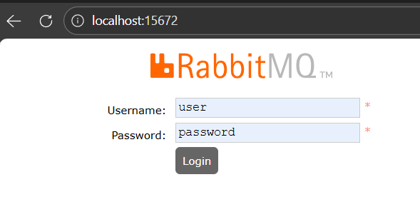

# ControlRabbit - Quick Start Guide
NOMBRE: Kevin Coloma
---
Sistema de microservicios con **UUID** (`orderId`, `customerId`, `productId`) y procesamiento de eventos con **RabbitMQ**.

---

```powershell
# 1. Iniciar infraestructura (DB + RabbitMQ)
cd infrastructure
docker-compose up -d
Start-Sleep -Seconds 10
docker ps

# 2. Compilar y ejecutar Order Service
cd ..\order-service
mvn clean package -DskipTests
java -jar target\order-service-1.0.0.jar

# 3. Ejecutar Inventory Service (en otra terminal)
cd ..\inventory-service
npm install
node index.js

# 4. Importar el archivo a Postman para pruebas listas
ControlRabbit.postman_collection.json

# 5. Verificar
Invoke-WebRequest http://localhost:8080/api/v1/orders -UseBasicParsing
Invoke-WebRequest http://localhost:18081/api/v1/inventory -UseBasicParsing
```

✅ Ambas deberían retornar **Status 200**


## Puertos en Uso

| Servicio          | Puerto | Ejecución                                        |
| ----------------- | ------ | ------------------------------------------------ |
| Order Service     | 8080   | `java -jar order-service-1.0.0.jar`              |
| Inventory Service | 18081  | `node index.js`                                  |
| PostgreSQL        | 5432   | Docker                                           |
| RabbitMQ          | 5672   | Docker                                           |
| RabbitMQ Admin    | 15672  | [http://localhost:15672](http://localhost:15672) |

---


---

## Estructura de Carpetas

```
ControlRabbit/
├── infrastructure/         # Docker (Postgres + RabbitMQ)
├── order-service/          # Spring Boot (8080)
├── inventory-service/      # Node.js Express (18081)
├── README.md
└── ControlRabbit.postman_collection.json
```

---

## Endpoints Clave

### Order Service (8080)

```
POST /api/v1/orders
GET  /api/v1/orders
GET  /api/v1/orders/{orderId}
```

### Inventory Service (18081)

```
GET /api/v1/inventory
GET /api/v1/inventory/{productId}
```

---

## Flujo End-to-End

```
[1] Cliente → Order Service
    ↓ Genera UUIDs
    ↓ Persiste en PostgreSQL

[2] Publica OrderCreatedEvent
    ↓ RabbitMQ

[3] Inventory Service consume evento
    ↓ Reserva o rechaza stock

[4] Order Service actualiza estado
```
---

## Requisitos Previos

* **Java 17+** → `java -version`
* **Maven 3.8+** → `mvn -version`
* **Node.js 18+** → `node -v`
* **Docker & Docker Compose** → `docker -v`

---

## Logs (Debug)

```powershell
# Order Service
Get-Content order-service\target\order.log -Tail 20

# Inventory Service
Get-Content inventory-service\server.log -Tail 20
```

---

## Detener Servicios

```powershell
Get-Process java -ErrorAction SilentlyContinue | Stop-Process -Force
Get-Process node -ErrorAction SilentlyContinue | Stop-Process -Force

docker-compose down
```

---

## Stack Tecnológico

* Java 17, Spring Boot 3.2
* Node.js 18, Express.js
* PostgreSQL 15
* RabbitMQ 3
* Arquitectura Event‑Driven / Microservices

---
